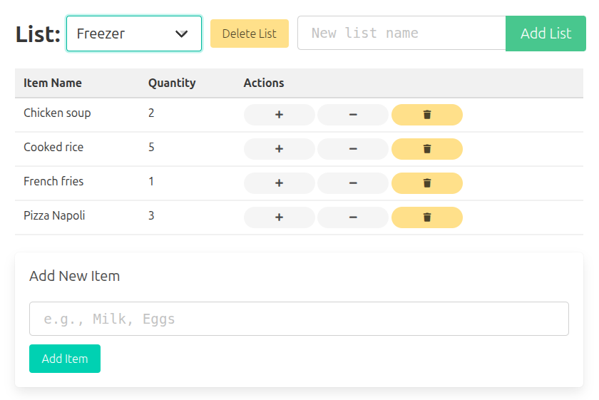

# FridgeMaster3000



## What is this app for?

FridgeMaster3000 is a web application designed to help you manage your fridge inventory. It allows you to track items and categorize them. Make lists of basically anything you can count and want to keep track of. 

## Running locally with py4web (without Docker)

To run the application locally using py4web, follow these steps:

1. **Clone the repository:**
   ```sh
   git clone https://github.com/Der-Mitdenker/fridgemaster3000.git
   cd fridgemaster3000
   ```

2. **Create a virtual environment and install dependencies:**
   ```sh
   python -m venv venv
   source venv/bin/activate  # On Windows use `venv\Scripts\activate`
   pip install -r requirements.txt
   ```

3. **Run the application:**
   ```sh
   py4web run . --host=0.0.0.0 -P 8001
   ```

4. Open your browser and go to http://localhost:8001

## Building and running the Docker container locally

To build and run the Docker container, follow these steps:

1. **Build the Docker image:**
   ```sh
   docker build -t fridgemaster3000:latest .
   ```

2. **Run the Docker container:**
   ```sh
   docker run -d -p 8001:8000 --name fridgemaster3000 fridgemaster3000:latest
   ```

3. Open your browser and go to http://localhost:8001

## Using the docker-compose file with the official container

To use the docker-compose file to run the official container from GitHub Container Registry, follow these steps:

1. **Update the image in docker-compose.yaml if needed:**
   ```yaml
   services:
     web:
       image: ghcr.io/your-username/fridgemaster3000:latest
       ports:
         - "8001:8000"
       volumes:
         - fridgemaster3000-data:/project-folder/apps/_default/databases

   volumes:
     fridgemaster3000-data:
   ```

2. **Run docker-compose:**
   ```sh
   docker-compose up -d
   ```

3. Open your browser and go to http://localhost:8001
